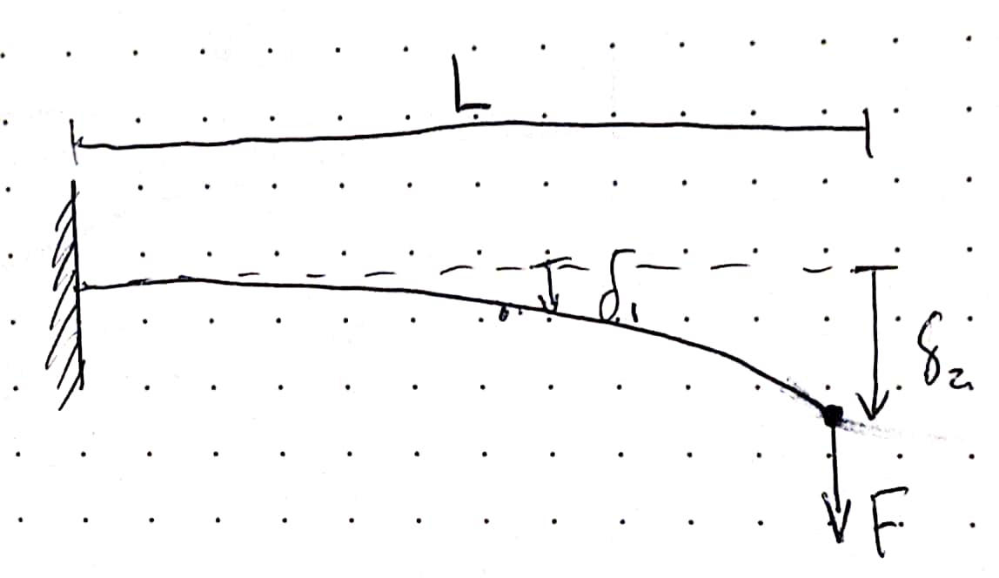
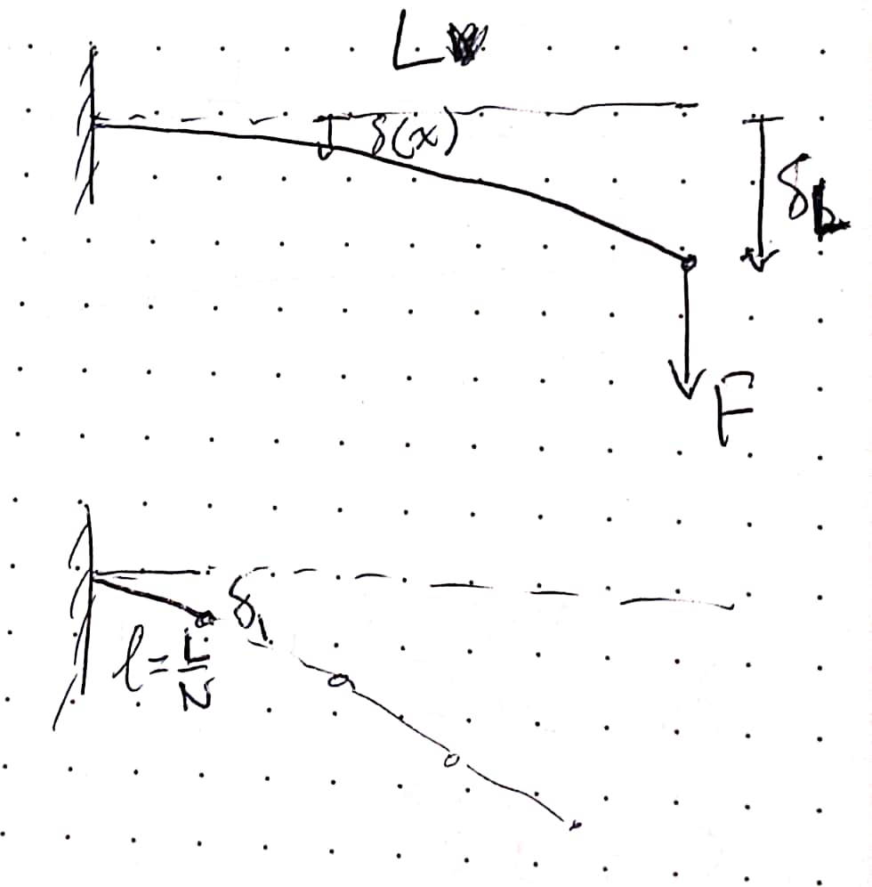
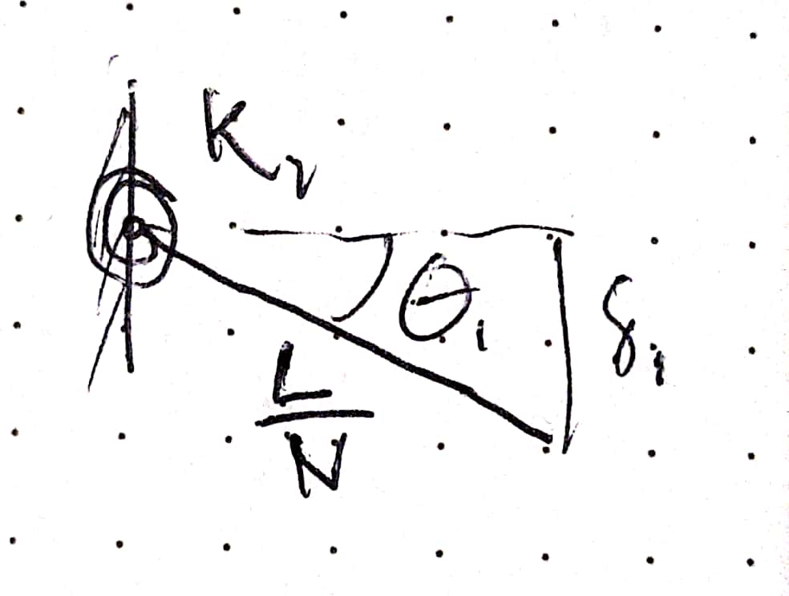
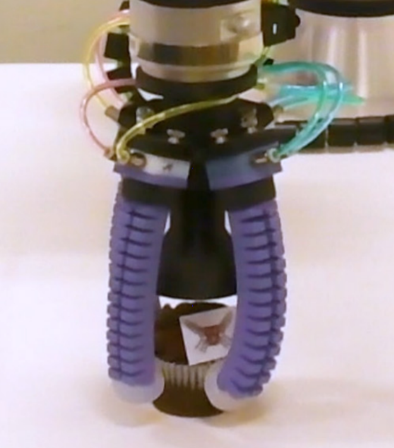

Calibration to Hardware
=======================

Introduction
------------

We are using a discretized model for soft actuators the converts continuous bending beams into rigid links and pin joints with torsional stiffnesses. To calibrate our simulated system to the real system, we need some way to relate deformation to joint angles.

Basic formulas
--------------

**Deflection,** :math:`\delta` **, of cantilever beam** as a function of position, :math:`x` along the beam, where :math:`\delta_L` is the deflection at the tip, and :math:`L` is the length of the beam:

:math:`\begin{align*} \delta(x) = \delta_L \left ( \frac{3x^2}{2L_2} - \frac{x^3}{2L^3} \right ) \\  \end{align*}`

   A simple beam of length :math:`L` with a tip load :math:`F` undergoes a tip deflection :math:`\delta`

**Bending moment,** :math:`M_b` **of a cantilever beam** with a tip load, :math:`F_{tip}`, as a function of position, :math:`x` along the beam:

:math:`\begin{align*}  M_b = F_{tip}(L-x) \\  \end{align*}`

**Linear bending stiffness,** :math:`K_b` of a cantilever beam at the tip:

:math:`\begin{align*}  K_b = \frac{F_tip}{\delta_L} \\  \end{align*}`

Calibrating Joint Stiffnesses
-----------------------------

For an actuator split evenly into :math:`N` segments, we make a few assumptions:

1. Bending stiffness represents the linear bending stiffness at the tip of the actuator at its unloaded state
2. Assume small angles (for calibration purposes), so :math:`sin(\theta) = \theta`
3. We want to match the deflection of each segment with an appropriate spring force given the bending moment in the actuator.

   The simple beam is discretized into :math:`N` equal-length segments connected by pin joints.

We find the formula for the deflection at the tip of the first segment during a load at the actuator's tip to be:

:math:`\begin{align*}  \delta(x=\frac{L}{N}) &= \left ( \frac{3(\frac{L}{N})^2}{2L_2} - \frac{(\frac{L}{N})^3}{2L^3} \right ) \delta_L \\  &= \left ( \frac{3L^2}{2N^2L^2} - \frac{L^3}{2N^3 L^3} \right ) \delta_L \\       &= \left ( \frac{3}{2N^2} - \frac{1}{2N^3} \right ) \delta_L = \delta_1  \end{align*}`

For the first segment with a length, :math:`\frac{L}{N}`, deflection :math:`\delta_1`, we can define a rotational spring constant, :math:`\kappa_1`, that achieves an angle, :math:`\theta_1` when a torque, :math:`\tau_1`, is applied on the joint.

   A simple pin joint with rotational spring

Thus, we obtain an equation for the spring constant:

:math:`\begin{align*}     \kappa_1 = \frac{\tau_1}{\theta_1} \end{align*}`

We can find what :math:`\theta_1` needs to be using the formula:

:math:`\begin{align*}     \sin(\theta_1) = \frac{\delta_1}{L_1}  = \frac{\delta_1}{\frac{L}{N}} \end{align*}`

and using the small angle assumption, we obtain :math:`\sin(\theta) = \theta`, so:

:math:`\begin{align*}     \theta_1 = \frac{N\delta_1}{L} \end{align*}`

Now, :math:`\tau_1` is assumed to be the bending moment withheld by this first link (the moment at :math:`x=0`). :

:math:`\begin{align*}     \tau_1 &= F_{tip}(L-0) = F_{tip}L \end{align*}`

Thus, we can move back to the joint stiffness:

:math:`\begin{align*}     \kappa_1 = \frac{\tau_1}{\theta_1} &= \frac{F_{tip}L}{ \frac{N\delta_1}{L}} \\     &= \frac{F_{tip}L)}{ \frac{N}{L}\left ( \frac{3}{2N^2} - \frac{1}{2N^3} \right ) \delta_L } \\     &= \frac{L}{ \frac{N}{L}\left ( \frac{3}{2N^2} - \frac{1}{2N^3} \right ) }\frac{F_{tip}}{\delta_L } \\    \kappa_1 &= \frac{ 1 }{ \frac{3}{2N} - \frac{1}{2N^2}  } L^2 K_b \end{align*}`

Determining appropriate actuator torques
----------------------------------------

We need to determine the actuation moment applied to actuators. Many of our physical systems are air-driven, so we can use blocked-force measurements at various pressures to get a rough estimate of actuation torques at pressures of interest.

During a blocked force measurement, we assume all force produced is balancing the internal actuation moment. Given this assumption, we get:

:math:`\begin{align*}     M_{act} =  F_b L \end{align*}`

Example:
--------

   Real soft robotic hand platform from :cite:`abondance2020dexterous`, where the mechanical properties of the fingers have been characterized.

From our paper on in-hand manipulation with soft fingers :cite:`abondance2020dexterous`, we measured the linear bending stiffnesses of our 0.1 m long fingers in the grasping and side axes:

:math:`\begin{align*}     K_g =& 6.12 \text{ N/m}  &  K_s =& 29.05 \text{ N/m} \end{align*}`

In our typical SoMo simulation of these fingers, we use 5 joints in each direction, so $N$ = 5 and $L$ = 0.1 m. Putting this through the formula for joint stiffnesses, we get:

:math:`\begin{align*}     K_{g, sim} =& 0.219 \text{ N/m}  &  K_{s, sim} =& 1.038 \text{ N/m} \end{align*}`

The last step is to scale the joint stiffnesses by the square of the world scale per the world scaling discussion. In many of our examples we use a world scale of 20, so scaling the stiffnesses by 400 results in:

:math:`\begin{align*}     K_{g, sim} = 87.4 &  \text{ sim stiffness units}  &  K_{s, sim} =& 415.0 \text{ sim stiffness units} \end{align*}`

To apply realistic actuation torques to the system, we calibrate the grasping axis on the 100 kPa value, which produced 0.75 N of force over the 0.1m length finger body. 

:math:`\begin{align*}     \tau_{act} = M_{act} =  F_b L = 0.075 \text{ Nm} \end{align*}`

Then we transform torques by the square of the world scale, so if we want to apply 100 kPa to the real life fingers, the the simulated fingers need:

:math:`\begin{align*}     \tau_{grasp} =  30 \text{ sim torque units} \end{align*}`

For the side-axis, we explicitly control the actuation torques in simulation, but the real system uses a pressure differential. Based on a differential of 100kPa to achieve reasonable side-to-side motion in the hardware, we estimate approximately 3 times the value for the grasping axis based on observations, resulting in:

:math:`\begin{align*}     \tau_{side} =  90 \text{ sim torque units} \end{align*}`

All these values produce physically accurate simulations that seem to work well!

References
----------

.. bibliography:: ../../refs.bib
