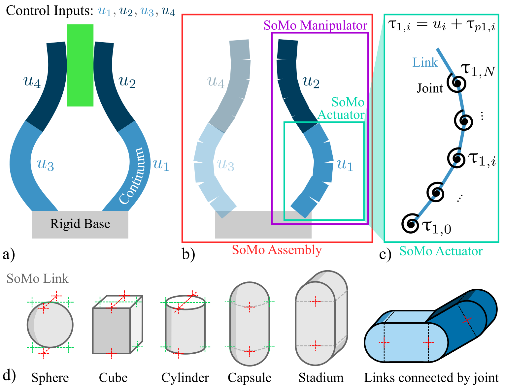

.. _basic-usage:

===========
Basic Usage
===========

This will walk you through setting up your first manipulator and complete simulation.

.. contents:: On this page
  :local:

Set up a definition file
====================

SoMo manipulators are defined as dictionaries describing one or more actuators, each of which is made up of several links and joints.

Here is an example of a typical definition of a soft finger made up of one bending actuator. You can copy this or directly download it:

:download:`ihm_finger_def.yaml <../../examples/design_studies/ihm_fingergait/definitions/ihm_finger_def.yaml>` 

.. literalinclude:: ../../examples/design_studies/ihm_fingergait/definitions/ihm_finger_def.yaml
  :language: yaml
  :linenos:

Build a SoMo Manipulator from a definition
====================

.. note::
	This documentation is coming soon!

Load the definition from a file directly
----------------

.. note::
	TODO

Modify a definition before creating
----------------

SoMo definitions are just python dictionaries, so you can load them in, make modifications, then instantiate a manipulator object.

Control a manipulator
====================

.. note::
	TODO